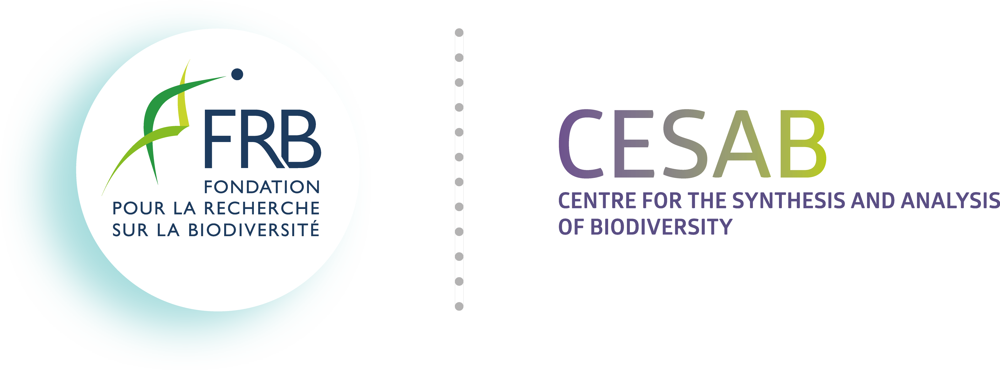

## Welcome to the Dynamite space :wave:

> The research project **Dynamite** (DYNAMics of the production and export of aragonITE shells) was selected from the [2023 DataSHARE Call](https://www.fondationbiodiversite.fr/en/calls/call-for-proposals-datashare-2023/) by the Centre for the Synthesis and Analysis of Biodiversity ([CESAB](https://www.fondationbiodiversite.fr/en/about-the-foundation/le-cesab/)) of the French Foundation for Biodiversity Research ([FRB](https://www.fondationbiodiversite.fr/en/)).

 

 

Planktonic organisms secreting a calcium carbonate (CaCO3) shell play a **key, multi-faceted role in the oceans’ ability to absorb CO2 from the atmosphere**. One of the main mineral forms taken by CaCO3 is called aragonite. **Surprisingly little is known about the aragonite cycle in the ocean**.

Aragonite is produced in modern oceans by pteropods, heteropods and janthinids, groups of pelagic snails, but the magnitude of this production is not quantified. For example, published estimates of aragonite’s contribution to global CaCO3 production in the modern ocean cover a very wide range, from 1% to 98%. Furthermore, the spatial distribution of aragonite production is unknown. This project aims to remedy this by bringing together an international group of scientists. Together, these experts will synthesize and compile a unique and comprehensive database to **reveal the dynamics of aragonite shell production and export in the world ocean today and over recent decades**.

**Dynamite** is led by [**Olivier SULPIS**](https://www.cerege.fr/fr/cerege/olivier-sulpis/) (CEREGE, France) and [**Julie MEILLAND**](https://www.cerege.fr/fr/cerege/julie-meilland/) (CEREGE, France) and include:

<table>
  <tr>
    <td><b>Member</b></td>
    <td><b>Affiliation</b></td>
  </tr>
<tr>
    <td>Nina Bednarsek</td>
    <td>Oregon State Univ. (USA)</td>
</tr>
<tr>
    <td>Fabio Benedetti</td>
    <td>Univ. Bern (Switzerland)</td>
</tr>
<tr>
    <td>Nicolas Casajus</td>
    <td>FRB-CESAB (France)</td>
</tr>
<tr>
    <td>Sonia Chaabane</td>
    <td>CEREGE (France)</td>
</tr>
<tr>
    <td>Thomas Chalk</td>
    <td>CEREGE (France)</td>
</tr>
<tr>
    <td>William Gray</td>
    <td>IPSL (France)</td>
</tr>
<tr>
    <td>Ben Gustafson</td>
    <td>Heriot Watt Univ. (UK)</td>
</tr>
<tr>
    <td>Nina Keul</td>
    <td>Christian Albrechts Univ. (Germany)</td>
</tr>
<tr>
    <td>Laura Khim</td>
    <td>CEREGE (France)</td>
</tr>
<tr>
    <td>Amy Maas</td>
    <td>Arizona State Univ. (USA)</td>
</tr>
<tr>
    <td>Clara Manno</td>
    <td>British Antarctic Survey (UK)</td>
</tr>
<tr>
    <td>Maria Moreno</td>
    <td>Univ. Autónoma de Nayarit (Mexico)</td>
</tr>
<tr>
    <td>Mark Ohman</td>
    <td>Univ. of California San Diego (USA)</td>
</tr>
<tr>
    <td>Katja Peijnenburg</td>
    <td>Univ. of Amsterdam (The Netherlands)</td>
</tr>
<tr>
    <td>Ralf Schiebel</td>
    <td>Max Planck Institute (Germany)</td>
</tr>
<tr>
    <td>Deborah Wall-Palmer</td>
    <td>Naturalis Biodiversity Center (The Netherlands)</td>
</tr>
<tr>
    <td>Patrizia Ziveri</td>
    <td>Universitat Autònoma de Barcelona (Spain)</td>
</tr>
</table>

